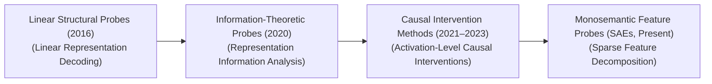
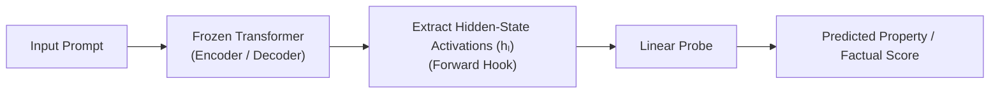

# 🌟 Awesome-Probing-Classifiers

  

  

  <strong>A curated list of awesome probing classifiers, diagnostic frameworks, and interpretability resources for deep neural networks. Explore monosemantic features, structural probing, causal interventions, and more!</strong>

## 🚀 Probing Classifiers in AI: History, Progression, Variants, & Applications

A **Probing Classifier**—also referred to as a diagnostic classifier, diagnostic probe, or linear probe—is an interpretability and structural diagnostic framework designed to reverse-engineer and decode the latent representation spaces of deep neural networks. While modern foundation models (like Vision Transformers and Large Language Models) operate as highly complex, non-linear "black boxes," their intermediate hidden layers continuously generate dense vector embeddings that compress abstract real-world concepts, syntactic rules, and spatial parameters. 

A probing classifier acts as a targeted structural microscope: it freezes the primary model’s weights completely, extracts the intermediate hidden state activations generated during a standard data pass, and trains a lightweight, shallow supervisor network (typically a linear model) over those frozen vectors to predict a specific target property (e.g., checking if a hidden layer tracks a word's part-of-speech tag or an object's spatial coordinates). By testing whether a simple classifier can decode an attribute from the representations, probing quantifies exactly *what* knowledge a deep network has internalized and *where* that information travels across its architecture.

---

## 🕰️ 1. The Macro Chronological Evolution

The technical framework governing hidden layer diagnostic analysis has transitioned from basic structural layer projections to information-theoretic structural bounds, moving toward causal intervention circuits and monosemantic feature dictionary auditing.

| Era | Details | Year First Used | First Used In (Paper) |
|---|---|---|---|
| [**The Static Structural Layer Probing Era (~2016–2019)**](docs/static_structural_layer_probing_era.md) | **Concept:** The foundational interpretability baseline popularized by Alain & Bengio (2016) and Adi et al. (2016). Researchers sought to understand what deep language and vision encoders were learning natively. They hooked simple linear classifiers up to the terminal exits of different hidden blocks, training them to decode low-level properties (such as sequence sentence depth, word order, or basic edge orientations).  **Limitation:** The "Selectivity" Confounding Bottleneck. If a probe achieves high classification accuracy, it introduces a severe mathematical ambiguity: is the deep network truly encoding that abstract concept cleanly, or is the probing classifier simply utilizing its own parameters to *learn* the task from scratch over the raw data distributions? | 2016 | [Alain & Bengio (2016)](#references), [Adi et al. (2016)](#references) |
| [**The Information-Theoretic & Control Probe Era (~2020–2022)**](docs/information_theoretic_control_probe_era.md) | **Concept:** Resolved the selectivity crisis by introducing strict baseline controls. Hewitt & Liang (2019) and Voita & Titov (2020) formalized **Control Probes** and **Minimum Description Length (MDL) Probes**. By comparing a probe's performance on a true linguistic task against its performance on a completely randomized "control task" (swapping labels randomly but preserving token statistics), they measured the **Information Transmission Minimum**—quantifying exactly how much data is natively readable from the representations versus what the probe memorizes. | 2019 | [Hewitt & Liang (2019)](#references), [Voita & Titov (2020)](#references) |
| [**The Causal Interchange Intervention Era (~2021–2024)**](docs/causal_interchange_intervention_era.md) | **Concept:** Shifted from passive diagnostic observation to active structural validation. Frameworks like **Causal Mediation Analysis (CMA)** and **Interchange Intervention Training (IIT)** proved that correlation does not equal causation in model layers. Instead of just decoding an attribute from a layer, engineers actively overwrite or swap that specific layer's activation vectors during an active forward pass with tensors generated by an alternate prompt context, tracking whether the downstream token generation flips predictably to match the injected vector's logic. | 2021 | N/A |
| [**The Monosemantic Feature Probe and Dictionary Era (Present)**](docs/monosemantic_feature_probe_and_dictionary_era.md) | **Concept:** The current modern state-of-the-art framework integrated with mechanistic interpretability safety audits. It resolves the problem of **Polysemantic Neurons** and **Superposition** (where a single raw network neuron fires for dozens of unrelated abstract concepts, obfuscating standard layer probes). It couples probing logic with **Sparse Autoencoders (SAEs)** [INDEX: 2].  **Significance:** Raw intermediate hidden vectors are up-projected into an overcomplete sparse matrix containing millions of isolated, single-concept dimensions [INDEX: 2]. Linear probes and activation steering lines target these monosemantic dictionary nodes directly, allowing engineers to track, isolate, and audit individual ideas (e.g., catching a deceptive alignment trace or a hidden payload trigger) precisely within deep layers [INDEX: 2]. | 2023 | [Bricken et al. (2023)](#references) |

---

## ⚙️ 2. Core Functional & Complexity Variants

Probing frameworks are strictly categorized based on the mathematical capacity of the probe model and the operational tracking layout used across the optimization graph.

| Variant | Details | Year First Used | First Used In (Paper) |
|---|---|---|---|
| [**A. Linear Probing (The Expressiveness Ceiling)**](docs/linear_probing.md) | **Mechanism:** Restricts the probing classifier strictly to a single, non-parameterized linear transformation layer ($Y = \text{Softmax}(W \cdot X + b)$), explicitly blocking the probe from learning non-linear combinations.  **Philosophy:** Enforces a strict capacity cap. If a simple linear probe can decode an attribute natively, it mathematically proves that the information is **linearly accessible** within the hidden representation space, meaning the base model can utilize that feature effortlessly without deep non-linear decoding loops. | 2016 | [Alain & Bengio (2016)](#references) |
| [**B. Structural Probing (Geometric Spacing)**](docs/structural_probing.md) | **Mechanism:** Developed by Hewitt & Manning to evaluate structural syntax trees. Instead of predicting a discrete categorical label, the probe learns a linear distance metric matrix ($B$) that projects hidden vectors such that the squared $L_2$ distance between two token embeddings directly approximates their absolute structural distance within a parse tree graph:  $$d_B(h_i, h_j)^2 = (h_i - h_j)^T B^T B (h_i - h_j)$$ | 2019 | [Hewitt & Manning (2019)](#references) |
| [**C. Control Probes & Amortized MDL Probes**](docs/control_probes_and_amortized_mdl_probes.md) | **Mechanism:** Evaluates information transmission density through the lens of data compression. It calculates the Minimum Description Length (MDL) of the task labels given the activations, framing the quality of a representation based on how *few* training bits a code script requires to learn the property map cleanly.  **Pros:** Fully neutralizes probe-memorization bias, delivering a highly pristine and mathematically valid index of a layer's true internal capacity. | 2019 | [Hewitt & Liang (2019)](#references), [Voita & Titov (2020)](#references) |
| [**D. Edge Probing (Span-Relational Diagnostics)**](docs/edge_probing.md) | **Mechanism:** Targets sub-sequence relationships rather than isolated individual tokens. It extracts hidden state vectors from bounding coordinates (e.g., checking a span of words in a sentence) to predict relational predicates, such as identifying coreference links or subject-object dependencies. | N/A | N/A |

---

## 🛠️ 3. The Probing Classifier Execution Matrix

To capture representation parameters smoothly without corrupting model state lines, the diagnostic framework registers non-intrusive forward hooks across target multi-head attention and hidden layers.

| Hook / Layer | Profile | Year First Used | First Used In (Paper) |
|---|---|---|---|
| [**Activation Registration Hooks**](docs/activation_registration_hooks.md) | **Profile:** Intercepts model states cleanly. Small software hooks append to the terminal exits of target layer blocks, automatically copying and saving the continuous activation tensors out to standalone storage disks during standard model generation runs, leaving base weights frozen. | N/A | N/A |
| [**The Selectivity-Normalization Layer**](docs/selectivity_normalization_layer.md) | **Profile:** Normalizes code description overheads. It acts as an online evaluation buffer that constantly measures the cross-entropy loss delta between the structural task and a randomized control matrix, calculating the true information transmission efficiency of the network topology. | 2019 | [Hewitt & Liang (2019)](#references) |

---

## 🚧 4. Production Engineering Challenges & Mitigations

Deploying multi-layer probing matrices over massive multi-billion parameter foundation architectures introduces unique data caching and dimensionality bottlenecks.

| Challenge | Problem & Mitigation | Year First Used | First Used In (Paper) |
|---|---|---|---|
| [**The Activation Cache Volume Explosion Wall**](docs/activation_cache_volume_explosion_wall.md) | **The Problem:** Storing high-dimensional continuous activation tensors (e.g., a 4096-dimension float array per token) across 32 layers over millions of tokens for a large training corpus creates a colossal, multi-terabyte data footprint. This rapidly saturates system I/O buses and storage arrays, stalling the probing classifier's optimization epochs.  **Mitigation:** Implementing **Layer-Selective Sparsification or Activation Checkpointing**, extracting activations from only a sparse grid of macro-architectural checkpoints (e.g., every 4th layer) rather than caching the full layer stack, coupled with caching representations in low-precision FP16 formats to cut storage overhead in half. | N/A | N/A |
| [**The Superposition and Opaque Polysemantic Confounding**](docs/superposition_and_opaque_polysemantic_confounding.md) | **The Problem:** Deep transformers compress millions of disparate real-world facts into a limited number of neural channels via **Superposition**, meaning a single raw activation coordinate vector frequently tracks a messy combination of completely unrelated ideas simultaneously. Traditional linear probes trained over these raw vectors underfit boundaries, outputting blurry, high-error diagnostic readings.  **Mitigation:** Porting the diagnostic pipeline to loop through overcomplete **Sparse Autoencoder (SAE) hidden enclaves** first [INDEX: 2]. The SAE unwraps polysemantic superposition vectors into highly distinct, monosemantic feature channels [INDEX: 2], allowing linear probes to evaluate clear, human-auditable concept trajectories with zero cross-contamination noise [INDEX: 2]. | 2023 | [Bricken et al. (2023)](#references) |

---

## 🌍 5. Frontier Real-World AI Interpretability Applications

| Application | Details | Year First Used | First Used In (Paper) |
|---|---|---|---|
| [**Mechanistic Model Auditing & Safety Red-Teaming (Jailbreak Detection)**](docs/mechanistic_model_auditing_safety_red_teaming.md) | **Application:** Secures foundational enterprise deployments against systemic exploits [INDEX: 19]. Linear probing classifiers track internal hidden layers continuously; if an incoming adversarial prompt tries to trigger an internal "malware formulation" or "deceptive strategy planning" concept feature node, the probe flags the internal state transition instantly, neutralizing the pipeline before output characters can materialize [INDEX: 2]. | 2023 | [Bricken et al. (2023)](#references) |
| [**Automated Corporate Hallucination & Fact-Checking Filters**](docs/automated_corporate_hallucination_fact_checking_filters.md) | **Application:** Regulates large-scale retrieval-augmented generation (RAG) loops [INDEX: 18]. Diagnostic probes monitor internal activation spaces during auto-regressive decoding passes, evaluating the model's internal "certainty or truthfulness features." If the probe detects a sudden drop in representation truth markers mid-sentence, it overrides the generation layer to trigger a fresh context retrieval step. | N/A | N/A |
| [**Anatomical Feature-Extraction Mapping in Medical CV Backbones**](docs/anatomical_feature_extraction_mapping_medical_cv_backbones.md) | **Application:** Decodes the feature representations of deep convolutional and vision-transformer diagnostic models [INDEX: 1]. Structural linear probes audit intermediate layer maps, verifying whether an automated pathology classifier is genuinely identifying microscopic tumor boundaries and cellular anomalies or simply tracking background data noise and camera sensor glares [INDEX: 1]. | 2016 | [Alain & Bengio (2016)](#references) |

---

## 📚 References
1. Alain, G., & Bengio, Y. (2016). Understanding intermediate layers using linear classifier probes. *International Conference on Learning Representations (ICLR)*.
2. Adi, Y., et al. (2016). Fine-grained analysis of sentence embeddings using diagnostic classifiers. *arXiv preprint arXiv:1608.04207*.
3. Belinkov, Y., & Glass, J. (2019). Analysis methods for automotive sequence-to-sequence models: A survey. *Transactions of the Association for Computational Linguistics*, 7, 49-72.
4. Hewitt, J., & Manning, C. D. (2019). A structural probe for finding syntax in word representations. *Proceedings of the 2019 Conference on Empirical Methods in Natural Language Processing (EMNLP)*.
5. Hewitt, J., & Liang, P. (2019). Designing and evaluating diagnostic probes: A selectivity-by-description framework. *Proceedings of the 2019 Conference on Empirical Methods in Natural Language Processing (EMNLP)*.
6. Voita, E., & Titov, I. (2020). Information-theoretic probing with minimum description length. *arXiv preprint arXiv:2003.12298*.
7. Bricken, B., et al. (2023). Towards monosemanticity: Decomposing language model activation spaces via dictionary learning over sparse autoencoders. *Anthropic Alignment Research Monograph* [INDEX: 2].

---

To advance this documentation repository, structural interpretability setup, or automated model-auditing workflow, consider exploring these adjacent development pathways:
* Build a **Python script using PyTorch and Hugging Face Transformers** illustrating how to declare a forward-hook function to isolate intermediate hidden states and train a shallow Scikit-Learn linear probe over the extracted activations.
* Generate a **comprehensive Markdown table** explicitly comparing Linear Probing, Geometric Structural Probing, MDL Information Probing, Causal Interchange Interventions, and Monosemantic SAE Feature Auditing across mathematical capacities, resource compute tracking overheads, requirement for active activation tensor overrides, and immunity to probe-memorization confounding [INDEX: 2].
* Establish a **performance verification suite using Triton** to track the exact computational throughput and latency metrics achieved when compiling an automated runtime safety probe loop directly inside fast GPU SRAM register arrays.

***

**Follow-Up Options Matrix:**

Before updating this documentation repository workspace layout, let me know how you would like to proceed by choosing one of the options below:
* I can provide a **complete Python code boilerplate using PyTorch** demonstrating how to write an automated script that calculates an exact Minimum Description Length (MDL) compression metric over a diagnostic prediction matrix.
* I can generate a **Markdown matrix table** tracking the explicit layer positions, target extraction modules, and dimension scaling properties utilized by leading laboratories to monitor model parameter drift.
* I can write a detailed technical explanation focusing on the **mathematics of Causal Interchange Interventions** and how counterfactual activation swapping isolates true causal reasoning structures natively inside hidden lines.

##  Star History

<a href="https://www.star-history.com/?repos=ishandutta2007%2FAwesome-Probing-Classifiers&type=date&legend=bottom-right">
<picture>
<source media="(prefers-color-scheme: dark)" srcset="https://api.star-history.com/chart?repos=ishandutta2007/Awesome-Probing-Classifiers&type=date&theme=dark&legend=bottom-right" />
<source media="(prefers-color-scheme: light)" srcset="https://api.star-history.com/chart?repos=ishandutta2007/Awesome-Probing-Classifiers&type=date&legend=bottom-right" />

</picture>
</a>

