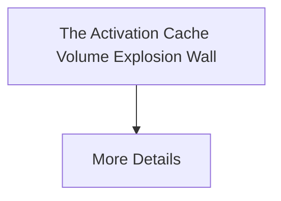

# The Activation Cache Volume Explosion Wall

[⬅️ Back to README](../README.md)

## Detailed Information

Addresses the colossal, multi-terabyte data footprint of storing high-dimensional continuous activation tensors using sparsification or checkpointing.

## Diagram

*(This page was auto-generated to provide detailed insights into The Activation Cache Volume Explosion Wall.)*
