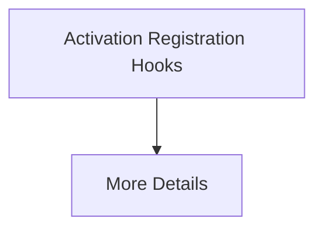

# Activation Registration Hooks

[⬅️ Back to README](../README.md)

## Detailed Information

Intercepts model states cleanly using small software hooks at the terminal exits of target layer blocks.

## Diagram

*(This page was auto-generated to provide detailed insights into Activation Registration Hooks.)*
