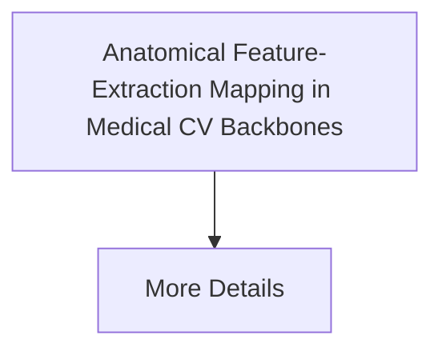

# Anatomical Feature-Extraction Mapping in Medical CV Backbones

[⬅️ Back to README](../README.md)

## Detailed Information

Decodes the feature representations of deep convolutional and vision-transformer diagnostic models using structural linear probes.

## Diagram

*(This page was auto-generated to provide detailed insights into Anatomical Feature-Extraction Mapping in Medical CV Backbones.)*
