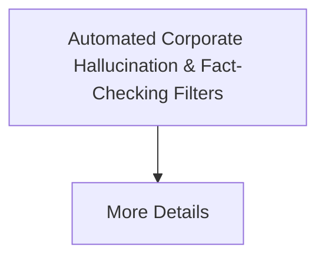

# Automated Corporate Hallucination & Fact-Checking Filters

[⬅️ Back to README](../README.md)

## Detailed Information

Regulates large-scale retrieval-augmented generation (RAG) loops by monitoring internal activation spaces for truthfulness.

## Diagram

*(This page was auto-generated to provide detailed insights into Automated Corporate Hallucination & Fact-Checking Filters.)*
