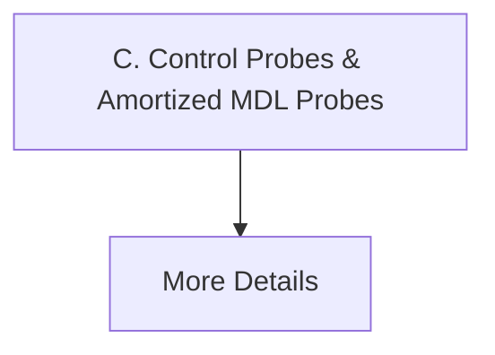

# C. Control Probes & Amortized MDL Probes

[⬅️ Back to README](../README.md)

## Detailed Information

Evaluates information transmission density through the lens of data compression, fully neutralizing probe-memorization bias.

## Diagram

*(This page was auto-generated to provide detailed insights into C. Control Probes & Amortized MDL Probes.)*
