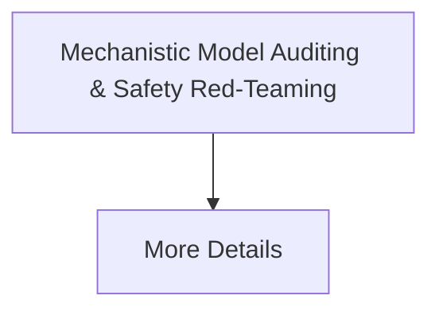

# Mechanistic Model Auditing & Safety Red-Teaming

[⬅️ Back to README](../README.md)

## Detailed Information

Secures foundational enterprise deployments against systemic exploits using continuous internal tracking.

## Diagram

*(This page was auto-generated to provide detailed insights into Mechanistic Model Auditing & Safety Red-Teaming.)*
