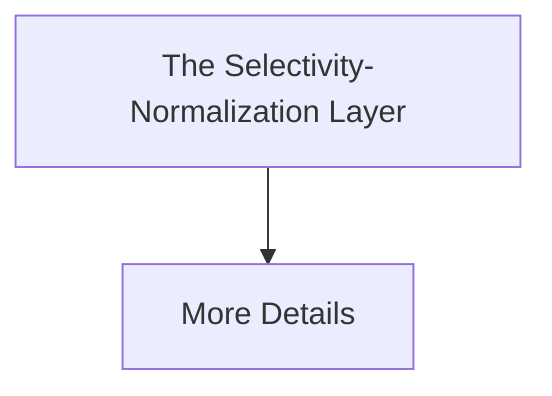

# The Selectivity-Normalization Layer

[⬅️ Back to README](../README.md)

## Detailed Information

Acts as an online evaluation buffer that constantly measures the cross-entropy loss delta between the structural task and a randomized control matrix.

## Diagram

*(This page was auto-generated to provide detailed insights into The Selectivity-Normalization Layer.)*
