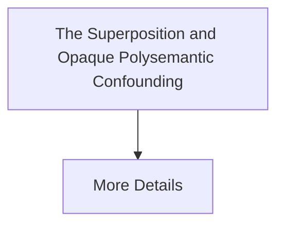

# The Superposition and Opaque Polysemantic Confounding

[⬅️ Back to README](../README.md)

## Detailed Information

Deep transformers compress millions of disparate real-world facts into a limited number of neural channels. Mitigation involves Sparse Autoencoders (SAEs).

## Diagram

*(This page was auto-generated to provide detailed insights into The Superposition and Opaque Polysemantic Confounding.)*
